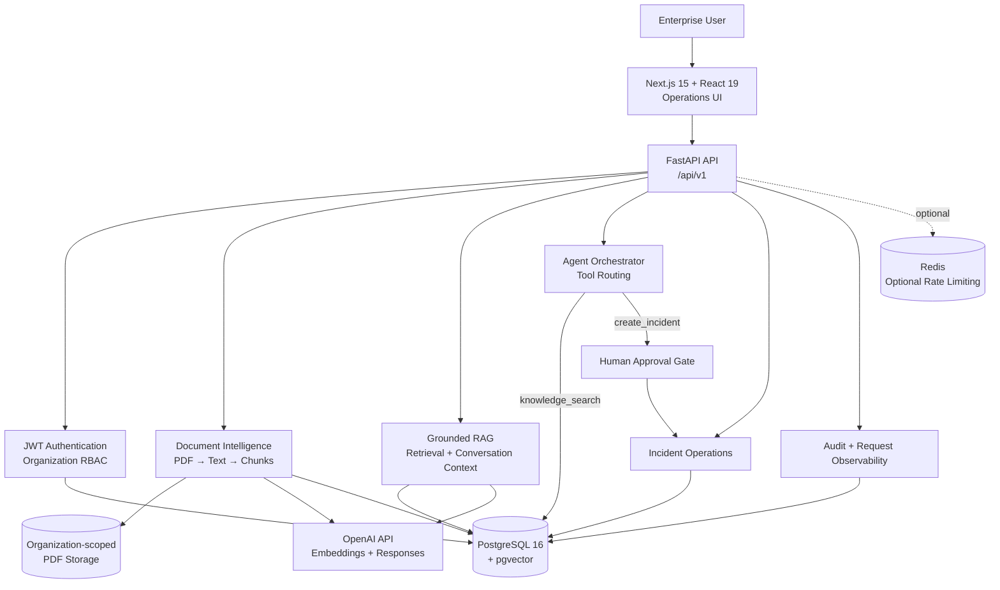
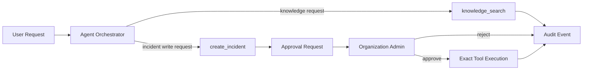
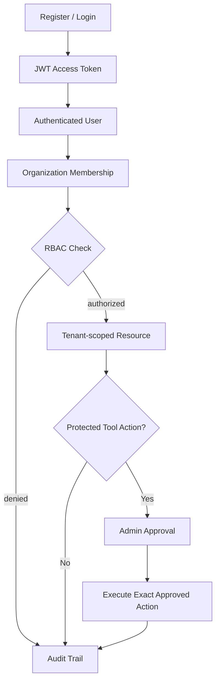
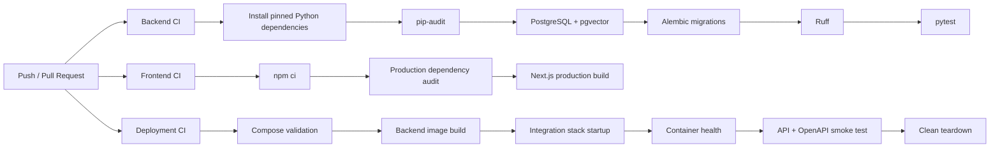

<div align="center">

# Enterprise AI Operations Platform

### AIOS · v1.0.0

**A secure, multi-tenant platform for enterprise document intelligence, grounded RAG, controlled AI tool execution, and operational workflows.**

<br />

<a href="https://github.com/BaharathBathula/Enterprise-AI-Operations-Platform-AIOS-/actions/workflows/backend-ci.yml">
  
</a>
<a href="https://github.com/BaharathBathula/Enterprise-AI-Operations-Platform-AIOS-/actions/workflows/frontend-ci.yml">
  
</a>
<a href="https://github.com/BaharathBathula/Enterprise-AI-Operations-Platform-AIOS-/actions/workflows/deployment-ci.yml">
  
</a>

<br /><br />


</div>

---

## Overview

**Enterprise AI Operations Platform (AIOS)** is a full-stack enterprise AI engineering platform built around four core concerns:

1. **Secure organizational access** — JWT authentication, tenant-scoped resources, and organization-level RBAC.
2. **Enterprise knowledge retrieval** — PDF ingestion, text extraction, chunking, embeddings, pgvector similarity search, and grounded answers.
3. **Controlled AI operations** — agent-directed tool execution with human approval for protected write actions.
4. **Operational accountability** — incidents, approval records, audit events, request IDs, structured logging, CI security gates, and runtime validation.

AIOS v1.0.0 represents the first completed engineering milestone of the project. The repository contains a production-oriented backend, a Next.js operations interface, PostgreSQL/pgvector persistence, AI retrieval services, agent tooling, automated tests, and continuous integration.

> **Scope note:** v1.0.0 is a validated application milestone, not a claim that the repository includes a complete cloud production environment. The backend container and PostgreSQL integration stack are validated in CI; cloud infrastructure is outside the current repository scope.

---

## Platform Architecture



### Document-to-answer flow


PDF uploads are currently limited to **20 MB** and must use the `application/pdf` content type with a `.pdf` extension.

---

## Core Capabilities

| Area | v1.0.0 implementation |
|---|---|
| **Authentication** | User registration, login, JWT access tokens, bcrypt-backed password hashing |
| **Multi-tenancy** | Organizations and organization-scoped application data |
| **RBAC** | `owner`, `admin`, `member`, and `viewer` organization roles |
| **Membership Operations** | Add members, update roles, remove members, transfer ownership |
| **Document Intelligence** | PDF upload, organization-scoped storage, text extraction, chunking and processing states |
| **Vector Knowledge** | OpenAI embeddings persisted with pgvector for semantic retrieval |
| **Grounded RAG** | Answers constrained to retrieved organizational document context |
| **Conversation History** | Persisted conversations and messages used for follow-up context |
| **Source Context** | Retrieved filename/page metadata represented as numbered sources |
| **Agent Orchestration** | Deterministic routing between knowledge search and operational incident creation |
| **Tool Registry** | Registered `knowledge_search` and `create_incident` tools |
| **Human Approval** | Write-sensitive incident creation requires an approval record before execution |
| **Approval Separation** | Users cannot approve or reject their own tool requests |
| **Incident Operations** | Organization-scoped incident creation and incident lifecycle APIs |
| **Audit Logging** | Organization-scoped events with event type, action, outcome and contextual details |
| **Request Observability** | Request IDs, request logging and global exception handling |
| **Rate Limiting** | Redis-backed rate limiter available through configuration; disabled by default |
| **Operations UI** | Dashboard routes for documents, knowledge, conversations, copilot, approvals, incidents and audit |
| **API Documentation** | FastAPI OpenAPI schema and interactive `/docs` interface |

---

## Controlled AI Execution

AIOS does not treat every AI-directed action as automatically executable.

The current agent orchestrator routes ordinary requests to enterprise knowledge search. Requests that explicitly ask to create/open/raise an incident are routed to the `create_incident` tool, which is classified as a protected write action.



An approved tool execution is validated against the recorded:

- organization
- tool name
- tool arguments
- approval state

The executor also records execution outcome and duration in the audit trail.

---

## Security Model



### Implemented controls

| Security layer | Control |
|---|---|
| **Identity** | JWT bearer access tokens using PyJWT |
| **Credential storage** | Password hashing through Passlib + bcrypt |
| **Authorization** | Organization membership dependencies and role-based access checks |
| **Tenant isolation** | Organization IDs carried through organization-scoped models, queries and tools |
| **Tool safety** | Approval-gated protected write action |
| **Separation of duties** | Self-approval and self-rejection are explicitly denied |
| **Auditability** | Authorization, tool approval and tool execution events persisted to audit logs |
| **Production secrets** | Production configuration rejects empty/weak JWT secrets and known development placeholders |
| **Database configuration** | Production rejects known development database credential patterns |
| **CORS** | Production rejects wildcard, empty and localhost-only trusted-origin configuration |
| **File input** | PDF-only upload validation with a 20 MB maximum |
| **Supply chain** | Python dependency audit and production npm vulnerability audit in CI |
| **Code quality** | Ruff runs as a non-mutating CI enforcement gate |
| **Runtime confidence** | Docker Compose startup, migrations, health checks and OpenAPI availability tested in Deployment CI |

Development defaults exist only to make local execution straightforward. They must not be treated as production credentials.

---

## Technology Stack

| Layer | Technology |
|---|---|
| **Frontend** | Next.js `15.5.24`, React `19.0.0`, TypeScript `5.7.2`, Lucide React |
| **Backend** | Python 3.12, FastAPI `0.141.1`, Uvicorn `0.35.0` |
| **Data Access** | SQLAlchemy `2.0.43`, Alembic `1.16.4` |
| **Database** | PostgreSQL 16 |
| **Vector Search** | pgvector |
| **Validation / Settings** | Pydantic `2.11.7`, pydantic-settings `2.10.1` |
| **Authentication** | PyJWT `2.13.0`, Passlib, bcrypt |
| **AI Provider** | OpenAI SDK `3.5.0` |
| **Default Embeddings** | `text-embedding-3-small` |
| **Default Chat Model** | `gpt-4.1-mini` |
| **PDF Processing** | PyMuPDF `1.26.3` |
| **Rate Limiting** | Redis client `6.4.0` |
| **Backend Testing** | pytest `9.0.3`, pytest-cov |
| **Backend Linting** | Ruff `0.12.7` |
| **Frontend CI Runtime** | Node.js 22 |
| **Containers** | Docker + Docker Compose |
| **Automation** | GitHub Actions |

All direct Python dependencies used by the milestone are pinned in `backend/requirements.txt`. Frontend dependencies are reproducibly installed through `package-lock.json`.

---

## API Overview

The FastAPI application exposes versioned routes under:

```text
/api/v1
```

The router currently includes these API domains:

```text
/api/v1
├── health
├── auth
├── users
├── organizations
├── organization members
├── tool approvals
├── documents
├── conversations
├── chat / RAG
├── audit
├── agent
└── incidents
```

Representative operations include:

| Domain | Examples |
|---|---|
| Authentication | Register, login |
| Users | Current-user operations |
| Organizations | Create and retrieve organizational workspaces |
| Members | Membership, role management and ownership transfer |
| Documents | Upload, list, retrieve, process and delete PDFs |
| Conversations | Create, list, inspect and delete conversations |
| RAG | Ask organization-grounded questions |
| Agent | Execute routed knowledge/tool requests |
| Tool Approvals | List, inspect, approve, reject and execute approved requests |
| Incidents | Organization-scoped operational incident management |
| Audit | Review organization audit records |
| Health | Application/database readiness checks |

When the backend is running:

```text
Swagger UI:    http://localhost:8000/docs
OpenAPI JSON:  http://localhost:8000/openapi.json
API root:      http://localhost:8000/
```

---

## Frontend Surface

The Next.js application currently contains routes for:

```text
/
├── /login
├── /documents
├── /knowledge
├── /conversations
├── /copilot
├── /approvals
├── /incidents
└── /audit
```

The frontend is built and production-compiled independently from the backend container.

> The current `docker-compose.yml` runs PostgreSQL and the FastAPI backend. The frontend is **not containerized in this milestone**.

---

## Repository Structure

```text
Enterprise-AI-Operations-Platform-AIOS-/
│
├── .github/
│   └── workflows/
│       ├── backend-ci.yml
│       ├── frontend-ci.yml
│       └── deployment-ci.yml
│
├── backend/
│   ├── alembic/
│   │   └── versions/
│   ├── app/
│   │   ├── agents/
│   │   ├── api/
│   │   ├── core/
│   │   ├── db/
│   │   ├── middleware/
│   │   ├── models/
│   │   ├── schemas/
│   │   ├── services/
│   │   ├── tools/
│   │   └── main.py
│   ├── tests/
│   ├── Dockerfile
│   ├── alembic.ini
│   └── requirements.txt
│
├── frontend/
│   ├── src/
│   │   ├── app/
│   │   ├── components/
│   │   └── lib/
│   ├── .env.example
│   ├── package.json
│   ├── package-lock.json
│   └── tsconfig.json
│
├── .env.example
├── .gitignore
├── docker-compose.yml
├── LICENSE
└── README.md
```

---

## Quick Start

### Prerequisites

You need:

- Git
- Docker Desktop / Docker Engine with Compose
- Node.js 22 recommended for frontend development
- Python 3.12 for direct backend development
- An OpenAI API key for embedding generation and RAG responses

### 1. Clone the repository

```bash
git clone https://github.com/BaharathBathula/Enterprise-AI-Operations-Platform-AIOS-.git
cd Enterprise-AI-Operations-Platform-AIOS-
```

### 2. Create local environment configuration

**macOS / Linux**

```bash
cp .env.example .env
```

**Windows PowerShell**

```powershell
Copy-Item .env.example .env
```

At minimum, review and replace development placeholders before using the configuration outside local development.

### 3. Start PostgreSQL and the backend

```bash
docker compose up --build
```

The stack performs:

```text
PostgreSQL startup
        ↓
PostgreSQL health check
        ↓
Alembic migrations
        ↓
FastAPI startup
        ↓
Backend health check
```

Backend:

```text
http://localhost:8000
```

API documentation:

```text
http://localhost:8000/docs
```

### AI provider configuration

Embedding generation and RAG generation require:

```text
OPENAI_API_KEY
```

The checked-in Compose configuration validates the backend/PostgreSQL runtime but does not embed a real OpenAI credential. Inject provider credentials securely in the backend process or deployment environment rather than committing them to the repository.

---

## Frontend Development

Open a second terminal:

```bash
cd frontend
```

Create the local environment file.

**macOS / Linux**

```bash
cp .env.example .env.local
```

**Windows PowerShell**

```powershell
Copy-Item .env.example .env.local
```

Install exactly the locked dependencies:

```bash
npm ci
```

Start the development server:

```bash
npm run dev
```

Frontend:

```text
http://localhost:3000
```

Production build:

```bash
npm run build
```

---

## Backend Development

From `backend/`:

```bash
python -m venv .venv
```

Activate the virtual environment and install dependencies:

```bash
python -m pip install --upgrade pip
pip install -r requirements.txt
```

Run migrations against a configured PostgreSQL database:

```bash
alembic upgrade head
```

Run the API:

```bash
uvicorn app.main:app --reload
```

Run linting:

```bash
ruff check app tests
```

Run tests:

```bash
pytest -v
```

Run the dependency security audit:

```bash
pip-audit -r requirements.txt
```

---

## Database Migrations

AIOS uses Alembic for schema evolution.

The current migration chain covers:

```text
Initial multi-tenant schema
        ↓
Documents
        ↓
Document chunks + vector embeddings
        ↓
Conversations + messages
        ↓
Tool approvals
        ↓
Incidents
        ↓
Structured audit events
```

Apply all migrations:

```bash
cd backend
alembic upgrade head
```

Inspect current revision:

```bash
alembic current
```

---

## Continuous Integration

AIOS uses three independent GitHub Actions workflows.



### Backend CI

Validates:

```text
Dependency installation
Python vulnerability audit
PostgreSQL connectivity
pgvector availability
Alembic migration chain
Ruff enforcement
Full pytest suite
```

### Frontend CI

Validates:

```text
Locked npm installation
High/critical production dependency audit
Next.js production compilation
Type validation during build
```

### Deployment CI

Validates the real container startup path:

```text
docker compose config
        ↓
backend image build
        ↓
PostgreSQL startup
        ↓
Alembic migrations
        ↓
backend health check
        ↓
root API request
        ↓
OpenAPI request
        ↓
stack teardown
```

---

## Production Configuration Guards

When:

```text
ENVIRONMENT=production
```

or:

```text
ENVIRONMENT=prod
```

the backend refuses to initialize with unsafe configuration such as:

```text
Blank or short JWT signing secrets
Known development JWT placeholders
Known development database credential patterns
Empty CORS origin configuration
Wildcard CORS
localhost-only CORS
```

This provides a fail-fast boundary between convenient local defaults and production configuration.

---

## Operational Boundaries of v1.0.0

This README intentionally distinguishes implemented functionality from future expansion.

**Included in the v1.0.0 milestone**

- FastAPI backend
- Next.js operations frontend
- PostgreSQL + pgvector
- JWT authentication
- Organization-scoped RBAC
- PDF ingestion and processing
- Embeddings and semantic retrieval
- Grounded RAG
- Conversation persistence
- Agent tool routing
- Human tool approvals
- Incident operations
- Audit logging
- Request observability
- Optional Redis-backed rate limiting
- Database migrations
- Backend containerization
- GitHub Actions security/quality/runtime gates

**Not included in the current repository**

- OCR
- Word/Excel/image ingestion
- Slack, Teams, Gmail, Jira, Salesforce or other SaaS connectors
- Generic workflow-engine scheduling
- Autonomous arbitrary tool planning
- Frontend Docker image
- Redis service in the checked-in Compose stack
- Terraform / AWS / Kubernetes infrastructure
- Managed production monitoring stack
- Refresh-token authentication

These are deliberate scope boundaries, not undocumented v1.0.0 capabilities.

---

## v1.0.0 Milestone

**v1.0.0** establishes the first stable project baseline around secure enterprise knowledge operations and approval-controlled AI execution.

### Milestone highlights

```text
✓ Full-stack Next.js + FastAPI platform
✓ Multi-tenant organizations and RBAC
✓ PDF → chunk → embedding → pgvector pipeline
✓ Grounded enterprise RAG
✓ Persisted conversations
✓ Agent orchestration and tool registry
✓ Human approval for protected write actions
✓ Incident lifecycle support
✓ Structured audit trail
✓ Request IDs and request logging
✓ Production secret/CORS configuration validation
✓ Python and npm dependency security gates
✓ Ruff enforcement without CI source mutation
✓ Backend container health checking
✓ Migration + runtime integration validation
✓ Direct backend dependency pinning
✓ Frontend lockfile reproducibility
✓ Three green CI pipelines required for closure
```

The v1.0.0 tag/release should represent the exact commit that passes the final Backend CI, Frontend CI, and Deployment CI closure gate.

---

## Design Principles

AIOS is built around several practical engineering principles:

- **Tenant boundaries first** — organization context is part of authorization and data access.
- **Ground AI answers in enterprise data** — document context is the factual authority for RAG responses.
- **Do not silently execute sensitive actions** — protected writes require explicit human approval.
- **Keep approvals bound to intent** — approved tool name and arguments must match execution.
- **Audit consequential actions** — security and operational decisions should leave evidence.
- **Fail unsafe production configuration early** — insecure placeholders should not survive startup.
- **Make CI enforce repository state** — automation validates code; it does not silently repair it.
- **Test the runtime, not only the source** — deployment validation starts the actual integration stack.

---

## Current Deployment Model

```text
┌────────────────────────────────────┐
│ Next.js Frontend                   │
│ Runs independently on port 3000    │
└─────────────────┬──────────────────┘
                  │ HTTP
                  ▼
┌────────────────────────────────────┐
│ FastAPI Backend                    │
│ Dockerized · port 8000             │
│ Alembic migrations on startup      │
└─────────────────┬──────────────────┘
                  │
                  ▼
┌────────────────────────────────────┐
│ PostgreSQL 16 + pgvector           │
│ Docker Compose managed locally/CI  │
└────────────────────────────────────┘
```

External production infrastructure, TLS termination, managed secret storage, managed databases, and cloud networking are deployment-environment responsibilities and are not implemented by this repository.

---

## License

This project is licensed under the **MIT License**. See [`LICENSE`](LICENSE).

---

<div align="center">

### Enterprise AI Operations Platform · AIOS

**v1.0.0 · Secure knowledge · Controlled execution · Auditable operations**

</div>
