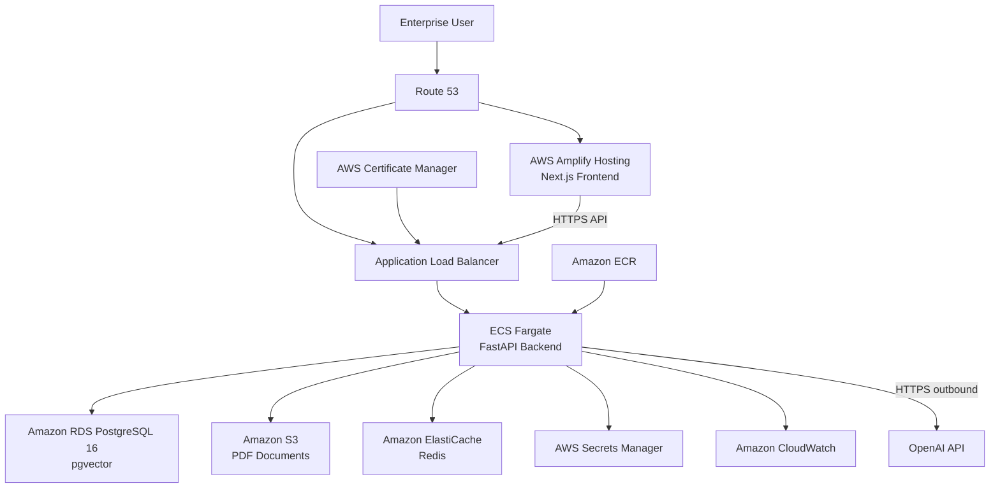
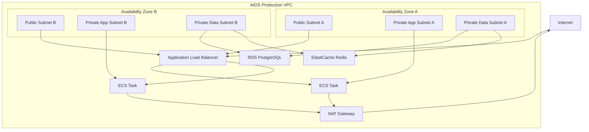
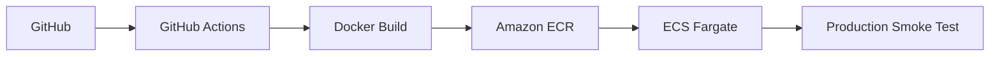
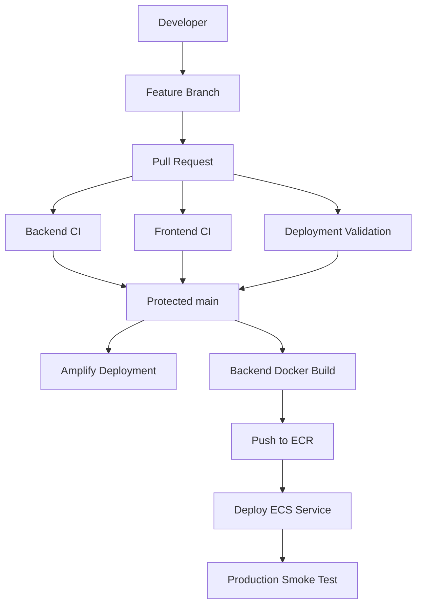

# AIOS Production Architecture

## Version

**Architecture milestone:** AIOS v1.1.0  
**Application baseline:** AIOS v1.0.0  
**Deployment target:** Amazon Web Services

---

## Purpose

This document defines the production deployment architecture for the Enterprise AI Operations Platform (AIOS).

The architecture is intentionally aligned with the application implemented in the repository rather than a generic enterprise cloud reference architecture.

The primary goals are:

- secure public application access
- private application and data workloads
- multi-Availability-Zone resilience
- managed persistence
- durable document storage
- centralized secret management
- observable application runtime
- automated container deployment
- controlled infrastructure evolution
- minimum unnecessary operational complexity

---

## Architecture Decision

AIOS v1.1.0 will use the following AWS services:

| Layer | AWS Service |
|---|---|
| Frontend | AWS Amplify Hosting |
| Backend | Amazon ECS on AWS Fargate |
| Container Registry | Amazon ECR |
| API Ingress | Application Load Balancer |
| Database | Amazon RDS for PostgreSQL 16 |
| Vector Search | pgvector |
| Document Storage | Amazon S3 |
| Rate Limiting | Amazon ElastiCache for Redis |
| Secrets | AWS Secrets Manager |
| DNS | Amazon Route 53 |
| TLS | AWS Certificate Manager |
| Logging / Metrics | Amazon CloudWatch |
| Networking | Amazon VPC |
| AI Provider | OpenAI API |

---

## High-Level Architecture



---

## Frontend Architecture

The AIOS frontend is implemented using Next.js.

Production hosting will use:

```text
AWS Amplify Hosting
```

The frontend will not be deployed as an ECS container during the v1.1.0 milestone.

### Responsibilities

Amplify will provide:

- frontend build execution
- managed hosting
- HTTPS
- deployment integration with the Git repository
- application delivery for the Next.js interface

### Intended application endpoint

```text
https://app.<domain>
```

The final domain will be configured during the DNS deployment phase.

---

## Backend Architecture

The FastAPI backend will run as a container using:

```text
Amazon ECS
AWS Fargate
```

Backend container images will be stored in:

```text
Amazon ECR
```

### Production request path

```text
Internet
   |
   v
Application Load Balancer
   |
   v
ECS Fargate Service
   |
   v
FastAPI Application
```

The ECS service should initially run across at least two Availability Zones.

Target baseline:

```text
Desired task count: 2
Launch type: Fargate
Public IP: disabled
```

ECS tasks must run inside private application subnets.

---

## Network Architecture

AIOS will use a dedicated VPC spanning two Availability Zones.



### Public subnets

Public subnets contain internet-facing infrastructure such as:

- Application Load Balancer
- NAT Gateway

### Private application subnets

Private application subnets contain:

- ECS Fargate tasks

ECS tasks must not receive public IP addresses.

### Private data subnets

Private data subnets contain:

- RDS PostgreSQL
- ElastiCache Redis

Neither database service should be publicly accessible.

---

## Security Group Model

### Application Load Balancer

Inbound:

```text
443/TCP from Internet
```

Outbound:

```text
Backend application port to ECS security group
```

HTTP port 80 may be used only for redirecting requests to HTTPS.

### ECS Backend

Inbound:

```text
Application traffic from ALB security group only
```

Outbound:

```text
PostgreSQL to RDS
Redis to ElastiCache
HTTPS to AWS services
HTTPS to OpenAI API
```

### RDS

Inbound:

```text
5432/TCP from ECS security group only
```

Public access:

```text
Disabled
```

### ElastiCache

Inbound:

```text
6379/TCP from ECS security group only
```

Public access is not permitted.

---

## Database Architecture

AIOS will use:

```text
Amazon RDS for PostgreSQL 16
```

The database must support:

```text
pgvector
```

because AIOS stores document embeddings for semantic retrieval.

### Production requirements

- private subnet placement
- encryption at rest
- automated backups
- Multi-AZ deployment
- deletion protection
- backup retention
- database credentials stored outside source control
- pgvector extension enabled through database migration/bootstrap procedures

---

## Document Storage

The v1.0.0 application currently supports PDF ingestion.

Production document storage will move from container-local filesystem storage to:

```text
Amazon S3
```

### Object layout

Recommended logical layout:

```text
organizations/
    <organization-id>/
        documents/
            <document-id>.pdf
```

Application records remain stored in PostgreSQL while PDF binary objects are stored in S3.

### Security requirements

The production bucket must:

- block public access
- enable encryption
- use least-privilege IAM access
- allow access only from the backend task role
- avoid credentials embedded in application source code

---

## ECS IAM Model

AIOS ECS tasks will use a dedicated ECS task IAM role.

The application task role should grant only the permissions required by the runtime.

Examples include:

```text
S3 document access
Secrets Manager secret retrieval
CloudWatch logging integration
```

The backend must not use static AWS access keys stored in application configuration.

---

## Secrets Architecture

Production secrets will use:

```text
AWS Secrets Manager
```

Sensitive configuration includes:

```text
DATABASE_URL
JWT_SECRET_KEY
OPENAI_API_KEY
REDIS_URL
```

Secrets must not be committed to:

```text
Git
Docker images
source code
production environment files stored in the repository
```

ECS will receive required secrets at runtime.

---

## Redis Architecture

AIOS already contains Redis-backed rate-limiting support.

Production will use:

```text
Amazon ElastiCache for Redis
```

Production configuration will enable:

```text
RATE_LIMIT_ENABLED=true
```

Redis must remain inside private networking and must only accept traffic from the ECS backend security group.

---

## AI Provider Connectivity

AIOS currently uses the OpenAI API for:

- document embedding generation
- grounded answer generation

ECS therefore requires controlled outbound HTTPS connectivity.

Private ECS tasks will reach external services through the NAT path:

```text
ECS Private Subnet
        |
        v
NAT Gateway
        |
        v
Internet
        |
        v
OpenAI API
```

No inbound connection from OpenAI to AIOS is required.

---

## DNS and TLS

DNS will use:

```text
Amazon Route 53
```

TLS certificates will use:

```text
AWS Certificate Manager
```

Target naming model:

```text
app.<domain>  -> Amplify
api.<domain>  -> Application Load Balancer
```

All production API traffic must use HTTPS.

---

## Logging and Monitoring

Production observability will use:

```text
Amazon CloudWatch
```

The ECS backend should emit application logs to CloudWatch Logs.

Monitoring should eventually cover:

- ECS task health
- ECS restart frequency
- ALB request volume
- ALB 4xx/5xx rates
- API latency
- RDS CPU
- RDS storage
- RDS connections
- Redis health
- application exceptions
- deployment failures

Alert thresholds will be defined during the observability phase of v1.1.0.

---

## Container Delivery

Backend delivery model:



A production deployment should never require SSH access to a server.

---

## Frontend Delivery

Frontend delivery model:

```text
GitHub
   |
   v
AWS Amplify
   |
   v
Next.js Build
   |
   v
Production Frontend
```

---

## Production Deployment Workflow

Target v1.1.0 workflow:



---

## Availability Strategy

The initial production baseline will use two Availability Zones.

This applies to:

- ALB subnet placement
- ECS service placement
- RDS Multi-AZ configuration
- data subnet architecture

The goal is to prevent a single Availability Zone outage from becoming an immediate total application outage.

---

## Backup Strategy

RDS production configuration must enable automated backups.

The milestone must eventually validate:

- backup creation
- recovery procedure
- point-in-time recovery capability
- documented restore process

S3 durability does not replace the need for application-level recovery planning.

---

## Environment Separation

The repository must maintain a clear distinction between:

```text
development
production
```

Production must not reuse local development values such as:

- development JWT secrets
- localhost CORS origins
- local database credentials
- local filesystem storage assumptions

Existing backend production validation remains part of this boundary.

---

## Deliberately Excluded from v1.1.0

The following are not required for this production milestone:

```text
Amazon EKS
Kubernetes
self-managed EC2 container hosts
self-managed PostgreSQL
self-managed Redis
public RDS
public Redis
frontend ECS service
manual production SSH administration
OCR
generic SaaS integrations
generic workflow orchestration
```

These features should only be introduced when application requirements justify their complexity.

---

## Infrastructure as Code

Production infrastructure will be represented as code rather than manually recreated from memory.

The infrastructure implementation phase will determine the exact repository structure and IaC tooling.

No infrastructure resource should contain hardcoded credentials.

---

## v1.1.0 Definition of Done

The Production Deployment milestone is complete only when:

- protected pull-request workflow is active
- production architecture is documented
- frontend is deployed through Amplify
- backend image is stored in ECR
- backend runs on ECS Fargate
- ALB provides HTTPS API ingress
- PostgreSQL runs privately on RDS
- pgvector is available
- production PDFs use S3
- Redis uses ElastiCache
- secrets use Secrets Manager
- production DNS and TLS are configured
- CloudWatch logging is active
- database backups are enabled
- production smoke tests pass
- deployment procedure is documented
- rollback procedure is documented
- final v1.1.0 release passes all required CI gates

---

## Architecture Status

**Decision status:** Approved

**Milestone:** AIOS v1.1.0 Production Deployment

This architecture is the production target for the v1.1.0 milestone unless a later reviewed architecture decision explicitly supersedes it.
